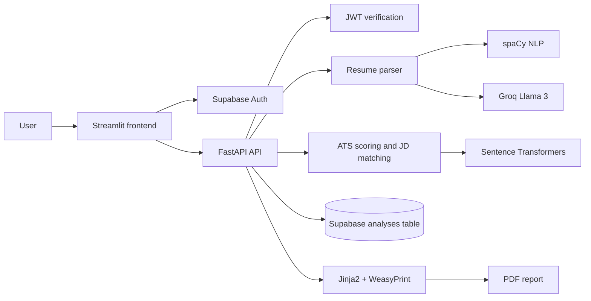

# ATS Resume Scorer

## 🚀 ATS Resume Scorer

An AI-powered resume analysis platform that evaluates resumes against job descriptions using NLP, semantic similarity, ATS scoring, and LLM-generated recommendations.

[](https://www.python.org/)
[](https://fastapi.tiangolo.com/)
[](https://streamlit.io/)
[](https://supabase.com/)
[](https://github.com/explosion/spaCy)

ATS Resume Scorer is a full-stack application for reviewing resumes against job descriptions, surfacing actionable improvement signals, and storing analysis history per authenticated user. It combines a FastAPI backend, a Streamlit user interface, Supabase authentication and persistence, traditional NLP, sentence embeddings, and Groq-powered structured extraction.

## Live Demo

Try the deployed Streamlit interface:

**[Open ATS Resume Scorer](https://appapppy-ktwxupi73vqhjzweksze9d.streamlit.app/)**

The backend defaults to `http://localhost:8000` and must be configured for the deployed frontend when running outside the local development setup.

## Screenshots

The following placeholders identify the primary product surfaces. Replace them with captured product screenshots when publishing a release.

| Resume Upload | ATS Dashboard |
| --- | --- |
|  |  |

| Job Description Analysis | PDF Report |
| --- | --- |
|  |  |

## Resume Highlights

- **Full-stack development:** A connected Streamlit experience and FastAPI service with typed request/response schemas.
- **FastAPI backend:** Versioned `/api/v1` endpoints for analysis, health checks, history, and PDF exports.
- **Streamlit frontend:** Landing, scorer, history, and resources views with responsive dashboard components.
- **NLP pipeline:** Resume parsing, section and issue analysis, keyword matching, and ATS-focused scoring.
- **Sentence Transformers:** Embedding-based semantic similarity for job-description comparison and skill evidence validation.
- **Groq Llama 3 integration:** `llama-3.3-70b-versatile` extracts structured resume and job-description data.
- **Supabase authentication and storage:** Email/password and Google OAuth sign-in, JWT verification, and per-user analysis history.
- **PDF report generation:** Jinja2 templates and WeasyPrint produce combined downloadable reports.

## Technology Stack

- Frontend: Streamlit
- Backend: FastAPI and Uvicorn
- Data validation: Pydantic
- NLP: spaCy
- Embeddings and similarity: Sentence Transformers and NumPy
- Resume parsing: PyPDF2, pdfplumber, python-docx, and python-magic
- ATS matching: RapidFuzz
- LLM parsing: Groq API (`llama-3.3-70b-versatile`)
- Authentication and persistence: Supabase
- JWT verification: PyJWT
- PDF export: Jinja2 and WeasyPrint
- HTTP clients: httpx and requests

## System Architecture



## Project Structure

```text
ats-resume-scorer/
├── backend/
│   ├── api/
│   │   ├── auth.py
│   │   └── routes.py
│   ├── core/
│   │   └── config.py
│   ├── database/
│   │   └── supabase_db.py
│   ├── models/
│   │   └── schemas.py
│   ├── services/
│   │   ├── ats_scorer.py
│   │   ├── feedback_engine.py
│   │   ├── groq_parser.py
│   │   ├── jd_matcher.py
│   │   ├── pdf_export.py
│   │   ├── recommendation_engine.py
│   │   ├── report_generator.py
│   │   ├── resume_analyzer.py
│   │   ├── resume_parser.py
│   │   └── ...
│   ├── templates/
│   │   ├── action_items.html
│   │   ├── jd_comparison.html
│   │   ├── quick_actions.html
│   │   └── summary.html
│   ├── utils/
│   │   ├── file_utils.py
│   │   └── matching.py
│   └── main.py
├── frontend/
│   ├── assets/
│   │   └── styles.css
│   ├── components/
│   │   ├── action_items.py
│   │   ├── dashboard.py
│   │   ├── detailed_feedback.py
│   │   ├── jd_comparison.py
│   │   ├── recommendations.py
│   │   ├── score_display.py
│   │   ├── skill_validation.py
│   │   └── strengths_issues.py
│   ├── services/
│   │   ├── api_client.py
│   │   └── supabase_client.py
│   ├── views/
│   │   ├── history.py
│   │   ├── landing.py
│   │   ├── resources.py
│   │   └── scorer.py
│   ├── .streamlit/
│   │   └── config.toml
│   └── streamlit_app.py
├── jupyter notebooks/
│   ├── 01_EDA_and_DATA_prep.ipynb
│   ├── 02_BERT_EMBEDDINGS.ipynb
│   └── 03_BERT_FINETUNEipynb.ipynb
├── .gitignore
├── LICENSE
├── requirements.txt
├── README.md
└── .env (local, not committed)
```

## Features

### Resume parsing and validation

The backend validates uploaded files before reading them:

- Maximum upload size: 5 MB
- Supported MIME types: PDF, DOC, and DOCX
- Supported extensions: `.pdf`, `.doc`, and `.docx`
- PDF text is extracted with `pdfplumber` or `PyPDF2`; DOCX text is extracted with `python-docx`
- Legacy `.doc` uploads return a clear error directing the user to convert the file to PDF or DOCX

### ATS scoring model

The scoring pipeline is assembled in `backend/services/resume_analyzer.py` and uses the following weights from `backend/core/config.py`:

| Category | Weight |
| --- | ---: |
| Formatting | 20% |
| Keywords | 25% |
| Content | 25% |
| Skill validation | 15% |
| ATS compatibility | 15% |

The application also computes an overall ATS score and an interpretation string for the final result.

### Job-description comparison

When a job description is provided, the application:

- Parses the job description with Groq
- Extracts keywords, required skills, and preferred skills
- Compares resume skills and keywords with the job description
- Computes semantic similarity with Sentence Transformer embeddings
- Identifies matched and missing keywords
- Highlights skills gaps

### Skill validation

The scoring engine checks whether detected skills are supported by project or experience evidence using semantic similarity thresholds. The response includes validated skills, unvalidated skills, totals, and a validation percentage.

### Issue detection and recommendations

`backend/services/feedback_engine.py` builds structured issue entries for common weaknesses, including missing resume sections, weak skills evidence, privacy or location concerns, weak bullet formatting, and low ATS readability. Each issue includes severity, ATS impact, explanation, location, remediation guidance, suggested actions, and an example improvement.

### PDF report generation

The application generates a combined PDF report from the analysis result using Jinja2 templates under `backend/templates/` and WeasyPrint. The report includes summary, action items, quick actions, and job-description comparison sections.

### History and data persistence

Authenticated users can retrieve and delete prior analyses from Supabase. The `analyses` table stores fields including:

- `user_id`
- `filename`
- `ats_score`
- `keyword_match`
- `missing_keywords`
- `created_at`
- `analysis_result` (the full JSON payload)

History is filtered by `user_id` and ordered by `created_at.desc`.

## API Documentation

The FastAPI application is mounted in `backend/main.py` with routes under `/api/v1`. Interactive documentation is available at `/docs` (Swagger UI) and `/redoc` when the backend is running.

| Method | Endpoint | Auth | Description |
| --- | --- | --- | --- |
| `GET` | `/api/v1/health` | Public | Reports whether the NLP model and embedder are loaded. |
| `POST` | `/api/v1/analyze-resume` | Bearer JWT | Accepts a resume upload and optional `job_description` form field; returns `AnalysisResponse`. |
| `GET` | `/api/v1/history` | Bearer JWT | Returns the signed-in user's prior analyses. |
| `DELETE` | `/api/v1/history/{analysis_id}` | Bearer JWT | Deletes an analysis if it belongs to the signed-in user. |
| `POST` | `/api/v1/generate-pdf` | Bearer JWT | Accepts an `AnalysisResponse` payload and returns a PDF download. |
| `GET` | `/api/v1/history/{analysis_id}/pdf` | Bearer JWT | Generates a PDF for a previously saved analysis. |

The root endpoint (`GET /`) returns API metadata and a list of available endpoints.

## Authentication Flow

### Frontend authentication

The Streamlit application manages authentication with `frontend/services/supabase_client.py`. Supported flows are:

- Email/password sign-in
- Email/password sign-up
- Google OAuth sign-in
- Local Streamlit session state for access and refresh tokens

For OAuth, the app reads the `code` query parameter, exchanges it for a Supabase session, and clears the query parameters after the exchange.

### Backend authentication

`backend/api/auth.py` reads a bearer token from the `Authorization` header and verifies it with either Supabase JWKS (`SUPABASE_URL`) for asymmetric tokens or `SUPABASE_JWT_SECRET` for HS256 tokens. It extracts the `sub` claim as the user ID and rejects missing, expired, or invalid tokens.

## Configuration

### Backend `.env`

```env
SUPABASE_URL="https://<project-ref>.supabase.co"
SUPABASE_KEY="<service-role-or-anon-key-for-db-write-access>"
SUPABASE_ANON_KEY="<public-anon-key>"
SUPABASE_JWT_SECRET="<supabase-jwt-secret>"
GROQ_API_KEY="<groq-api-key>"
SENTENCE_TRANSFORMER_MODEL="all-MiniLM-L6-v2"
```

`SUPABASE_URL` and `SUPABASE_JWT_SECRET` support backend JWT verification. `SUPABASE_KEY` is used for backend Supabase REST writes, while `SUPABASE_ANON_KEY` is used by the frontend auth client. `GROQ_API_KEY` is required for resume and job-description parsing. `SENTENCE_TRANSFORMER_MODEL` is optional and defaults to `all-MiniLM-L6-v2`.

### Frontend Streamlit secrets

The frontend can read configuration from `frontend/.streamlit/secrets.toml` or environment variables.

```toml
[supabase]
SUPABASE_URL = "https://<project-ref>.supabase.co"
SUPABASE_ANON_KEY = "<public-anon-key>"

[google_oauth]
redirect_uri = "http://localhost:8501"

[backend]
url = "http://localhost:8000"
```

Never commit real credentials. The repository excludes local environment files through `.gitignore`.

## Installation and Local Development

### 1. Create a virtual environment

```bash
python -m venv .venv
```

```bash
# Windows
.venv\Scripts\activate

# macOS/Linux
source .venv/bin/activate
```

### 2. Install dependencies

```bash
pip install -r requirements.txt
```

The consolidated dependency list includes FastAPI, Uvicorn, Pydantic, `python-multipart`, `python-dotenv`, spaCy, Sentence Transformers, NumPy, RapidFuzz, PDF/DOCX parsers, Jinja2, WeasyPrint, httpx, Groq, PyJWT, Streamlit, requests, and Supabase.

### 3. Download the spaCy model

The runtime configuration loads `en_core_web_sm`.

```bash
python -m spacy download en_core_web_sm
```

### 4. Configure secrets

Create a root-level `.env` file using the variables above. Optionally create `frontend/.streamlit/secrets.toml` for frontend-specific settings.

### 5. Start the backend

From the project root:

```bash
uvicorn backend.main:app --reload --host 0.0.0.0 --port 8000
```

The API is available at `http://localhost:8000`, with Swagger UI at `http://localhost:8000/docs` and ReDoc at `http://localhost:8000/redoc`.

### 6. Start the frontend

In a second terminal:

```bash
streamlit run frontend/streamlit_app.py
```

The Streamlit app is served at `http://localhost:8501`.

### Platform notes

- WeasyPrint requires system libraries such as Cairo and Pango on Linux. For Debian/Ubuntu:

  ```bash
  sudo apt install -y libcairo2 libpango-1.0-0 libpangoft2-1.0-0 libffi-dev
  ```

- `python-magic` depends on the underlying operating-system library being installed correctly.

## Deployment

The Streamlit frontend is deployed at the live-demo URL above. A separate FastAPI deployment can run the same `uvicorn backend.main:app` entry point.

For a production deployment:

1. Provide the backend environment variables through the hosting provider's secret manager.
2. Configure the frontend's `backend.url` to point to the deployed API.
3. Add the deployed Streamlit origin to `ALLOWED_ORIGINS` in `backend/core/config.py`.
4. Configure the Supabase OAuth redirect URI for the deployed Streamlit URL.
5. Install the operating-system libraries required by WeasyPrint and `python-magic`.
6. Ensure a Supabase `analyses` table exists; the application writes records through the Supabase REST API and does not create migrations at runtime.

The current configuration is optimized for local development and includes a hardcoded deployed Streamlit origin that may need adjustment for another environment.

## Application Workflow

1. The user signs in with Supabase from the Streamlit sidebar.
2. The user uploads a resume on the ATS Scorer page.
3. The user optionally pastes or uploads a `.txt` job description.
4. The frontend sends the resume and job description to FastAPI with an `Authorization: Bearer <supabase-access-token>` header.
5. The backend validates the file, extracts text, and parses the document using Groq and NLP services.
6. The scoring pipeline computes the ATS rating, comparison data, and detailed issue list.
7. The result is saved to Supabase for the authenticated user when the backend is configured with the Supabase service key.
8. The user can review history, export a PDF report, and delete saved records.

## Notable Implementation Details

- `backend/main.py` loads spaCy during application startup and configures CORS for allowed origins.
- `frontend/streamlit_app.py` handles OAuth callbacks and navigation between landing, scorer, history, and resources views.
- `backend/services/report_generator.py` converts structured analysis data into HTML report fragments.
- `backend/services/pdf_export.py` combines the HTML documents into a PDF.
- `backend/services/feedback_engine.py` diagnoses ATS-relevant resume weaknesses and generates recommendations.
- `backend/utils/file_utils.py` provides fallback defaults when grammar, location, or skill-validation data is unavailable.

## Database Notes

The application expects a Supabase table named `analyses` for analysis records. There are no SQL migration files in the repository; inserts and history queries use the Supabase REST API. The runtime does not create local SQLite or PostgreSQL tables.

## Jupyter Notebooks

The `jupyter notebooks/` directory contains research artifacts for exploratory data preparation and embeddings work:

- `01_EDA_and_DATA_prep.ipynb`
- `02_BERT_EMBEDDINGS.ipynb`
- `03_BERT_FINETUNEipynb.ipynb`

These notebooks are not required to run the application and are separate from the production analysis pipeline.

## Future Enhancements

- Add automated backend and frontend tests for scoring, authentication, and report generation.
- Move CORS origins and deployment URLs entirely into environment-based configuration.
- Add database migrations and documented Supabase row-level security policies.
- Add background processing and progress reporting for larger documents and LLM calls.
- Add batch resume comparison and side-by-side job-targeting views.
- Add versioned scoring profiles for different industries and job families.
- Replace screenshot placeholders with maintained product screenshots and accessibility-focused UI documentation.
- Add observability for model latency, parsing failures, and report-generation errors without logging resume contents.

## Security and Privacy Notes

- Supabase auth provides user identity and per-user persistence.
- JWT verification occurs server-side before analysis and history access.
- The backend checks for privacy risks such as street addresses and ZIP codes in resume text.
- Environment files and secrets are excluded from version control through `.gitignore`.
- Resume parsing and job-description extraction use the configured Groq service; do not upload confidential material unless that data-handling policy is acceptable.

## License

This project is licensed under the MIT License. See the LICENSE file for details.
